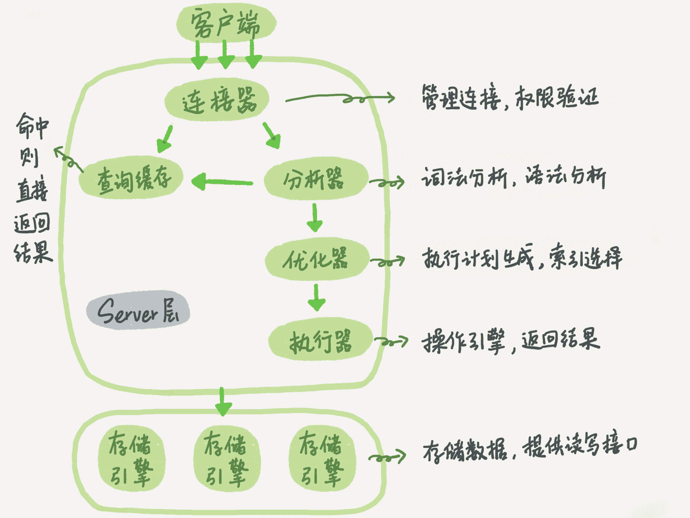
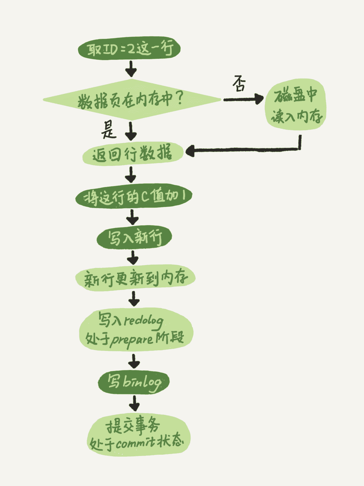

## 数据库

1. InnoDB & MyISAM
    - 事务
    - 行锁  MyISAM表级锁
    - 崩溃恢复
    - 外键
    - MVCC
2. InnoDB & MyISAM 数据存放
    - MyISAM data域存放数据地址
    - InnoDB data域存放数据本身  -> 聚簇索引
3. 并发问题
    - 肮读  Read-Uncommited
    - 不可重复读  Read-commited会有问题，只要commit就能读到
    - 幻读 T1读，T2插入，T1再读
    - select @@tx_isolation 
4. Next-Key lock 解决幻读  gap lock 防止在一个范围内插入数据
5. 数据库分片方案
    1. 客户端代理Sharding-JDBC
    2. 中间件 MyCat
6. 分布式id  
    原因: 每个数据库的id都是从1开始  
    1. UUID  缺点:太长 无序
    2. 数据库id   缺点:独立部署，维护成本，性能瓶颈
    3. Redis
    4. Snowflake
7. 数据库查询顺序  

8. 数据库更新  

9. redo log vs. binlog  
    - redo:
        - 物理日志 引擎层 InnoDB特有   
        - WAL (Write-Ahead Logging) 先日志，后更新内存  
        - 固定大小，比如4个文件每个1G
        - 作用: 数据异常处理恢复  Crash-safe
    - binlog:
        - 逻辑日志
        - 日志归档 用于备份、主从复制
10. 两阶段提交意义:
    1. **先写redo log后写binlog**。假设在redo log写完，binlog还没有写完的时候，MySQL进程异常重启。由于我们前面说过的，redo log写完之后，系统即使崩溃，仍然能够把数据恢复回来，所以恢复后这一行c的值是1。
    但是由于binlog没写完就crash了，这时候binlog里面就没有记录这个语句。因此，之后备份日志的时候，存起来的binlog里面就没有这条语句。
    然后你会发现，如果需要用这个binlog来恢复临时库的话，由于这个语句的binlog丢失，这个临时库就会少了这一次更新，恢复出来的这一行c的值就是0，与原库的值不同。

    2. **先写binlog后写redo log**。如果在binlog写完之后crash，由于redo log还没写，崩溃恢复以后这个事务无效，所以这一行c的值是0。但是binlog里面已经记录了“把c从0改成1”这个日志。所以，在之后用binlog来恢复的时候就多了一个事务出来，恢复出来的这一行c的值就是1，与原库的值不同。
11. 谨慎使用分区表  
    分区表在物理上表现为多个文件，在逻辑上表现为一个表；  
    谨慎选择分区键，跨分区查询效率可能更低；  
    建议采用物理分表的方式管理大数据
12. 冷热数据分离 -> 减小表的宽度  
    - 减少磁盘 IO,保证热数据的内存缓存命中率（表越宽，把表装载进内存缓冲池时所占用的内存也就越大,也会消耗更多的 IO）；  
    - 更有效的利用缓存，避免读入无用的冷数据
13. 高性能数据库
    1. 同财务相关的金额类数据必须使用 decimal 类型 -> 精准
    2. 使用 TIMESTAMP(4 个字节) 或 DATETIME 类型 (8 个字节) 存储时间
        - 可以比较
        - 占用空间小
    3. 尽可能把所有列定义为 NOT NULL
        - 索引 NULL 列需要额外的空间来保存，所以要占用更多的空间
        - 进行比较和计算时要对 NULL 值做特别的处理
    4. 少用text/Blob 占用空间
    5. 单张表索引不超过 5 个
    6. 索引建议
        - Where, order by, group by
        - 区分度高
        - 字段长度小
        - 使用频繁
    7. 频繁查询 --> 覆盖索引: 所有查询字段的索引
        - 避免回表
        - 随机 IO 变成顺序 IO 加快查询
    8. Inner join 、left join、right join，优先使用Inner join，如果是left join，左边表结果尽量小 -> 小表驱动
        - 左表会返回所有行
    9. 优化limit分页
        - limit 实现，但是当偏移量特别大的时候，查询效率就变得低下。
        - `select id，name，age from employee limit 10000，10`
        - 修改
            - //方案一 ：返回上次查询的最大记录(偏移量)  
            `selectid，name from employee where id>10000 limit 10.·`
            - //方案二：orderby + 索引  
            `selectid，name from employee order by id limit 10000，10`
            - //方案三：在业务允许的情况下限制页数：
    10. 应尽量避免在 where 子句中使用!=或<>操作符，否则将引擎放弃使用索引而进行全表扫描
        - `select age,name  from user where age <>18;`
        - 修改为  
        `select age,name  from user where age <18;`  
        `select age,name  from user where age >18;`
    11. 慎用distinct关键字  
        - 查询一个字段或者很少字段的情况下使用时，给查询带来优化效果。但是在字段很多的时候使用，却会大大降低查询效率
        - 反例: `SELECT DISTINCT * from  user;`  
        - 正例: `SELECT DISTINCT name from user;`
14. 开发规范
    1. 预编译语句进行数据库操作
        - 一次解析, 多次使用，高效
        - 防止SQL注入
    2. 避免使用子查询
        - 原因: 子查询结果集没有索引，速度慢
    3. 避免使用 JOIN 关联太多的表
        - 原因: MySQL 中，对于同一个 SQL 多关联（join）一个表，就会多分配一个关联缓存(Join_Buffer_Size)，如果在一个 SQL 中关联的表越多，所占用的内存也越大。如果Join_Buffer_Size设置不合理。临时表没有索引。
    4. 对应同一列进行 or 判断时，使用 in 代替 or
        - in 的值不要超过 500 个，in 操作可以更有效的利用索引，or 大多数情况下很少能利用到索引, 会使索性失效
        - `select * fromuserwhere user id=1 or age = 18`
        - //使用union all  
        `select * fromuserwhere userid=1`  
        `unionall`  
        `select * fromuserwhere age = 18`  
        //或者分开两条sql写：  
        `select * fromuserwhere userid=1`  
        `select * fromuserwhere age = 18`
    5. WHERE 从句中禁止对列进行函数转换和计算 
        - 原因: 无法利用索引 
        - `where date(create_time)='20190101'`
        - 修改为 `where create_time >= '20190101' and create_time < '20190102'`
    6. 超 100 万行的批量写 (UPDATE,DELETE,INSERT) 操作,要分批多次进行操作
        - 大批量操作可能会造成严重的主从延迟
        - binlog 日志为 row 格式时会产生大量的日志
        - 避免产生大事务操作

15. 一条SQL语句执行得很慢的原因有哪些？
    1. 偶尔很慢
        - 刷脏页
            - redo log满了
            - 内存满了
            - 系统认为空闲
            - MySQL关闭
        - 锁
    2. 一直很慢
        - 没有用上索引
            - 没有索引
            - 对字段进行运算、函数操作
        - 数据库选错索引
            根据采样统计索引区分度(基数), 如果采样不准确, 以为基数很小，走全表扫描

