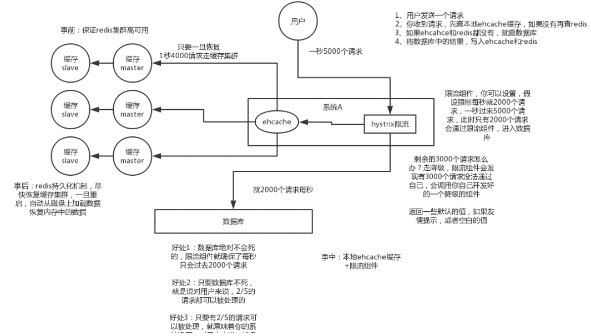

## Redis

1. Redis有哪些数据结构
    - String Hash List set SortSet
    - Bitmap HyperLogLog Stream GeoHash BloomFilter
2. Redis优缺点  
    - 优点：
        - 读写性能 -->高性能 高并发
        - 支持事务
        - 支持持久化
        - 数据结构丰富
        - 主从复制  
    - 缺点
        - 容量受到物理内存的限制
        - 难以在线扩容
        - 可能部分数据丢失
2. 速度快的原因
    1. 纯内存
    2. C语言
    3. 单线程
    4. IO多路复用
    5. 单线程，无锁竞争
3. `Keys pattern` & `Scan cursor [pattern] [count]`
    - keys指令会导致线程阻塞一段时间，线上服务会停顿,不能线上服务
    - Scan渐进式 O(1)，如果键修改，导致新键没有遍历到，遍历出老键
4. Redis做异步队列
    - rpush生产消息，lpop消费消息，blpop，在没有消息的时候，它会阻塞住直到消息到来
5. 为什么要用pipeline?
    - 多次IO往返的时间缩减为一次，前提是pipeline执行的指令之间没有因果相关性
    - pipeline 不是原子性的
6. Redis pub/sub有什么缺点 
    - 数据可靠性无法保证, 发布者发送完消息便不管了
    - 扩展性太差 -- 不能通过增加消费者来加快消耗发布者的写入的数据，如果发布者发布的消息很多，则数据阻塞在通道中已等待被消费着来消耗
7. Redis如何实现延时队列？
    - 使用sortedset，拿时间戳作为score，消息内容作为key调用zadd来生产消息，消费者用zrangebyscore指令获取N秒之前的数据轮询进行处理
8. Redis持久化
    - RDB做镜像全量持久化，AOF做增量持久化
    - 用RDB持久化文件重新构建内存，再使用AOF重放近期的操作指令来实现完整恢复重启之前的状态
9. 突然掉电？
    - 高性能的要求下每次都sync是不现实的，一般都使用定时sync，比如1s1次，这个时候最多就会丢失1s的数据
10. 是否使用过Redis集群，集群的高可用怎么保证，集群的原理是什么
    - **Redis Sentinal** 着眼于高可用，在master宕机时会自动将slave提升为master，继续提供服务。

    - **Redis Cluster** 着眼于扩展性，在单个redis内存不足时，使用Cluster进行分片存储
11. RDB原理
    - **fork和cow**。fork是指redis通过创建子进程来进行RDB操作，cow指的是*copy on write*，子进程创建后，父子进程共享数据段，父进程继续提供读写服务，写脏的页面数据会逐渐和子进程分离开来
12. Redis同步机制
    - Redis可以使用主从同步，从从同步。第一次同步时，主节点做一次bgsave，并同时将后续修改操作记录到内存buffer，待完成后将RDB文件全量同步到复制节点，复制节点接受完成后将RDB镜像加载到内存。加载完成后，再通知主节点将期间修改的操作记录同步到复制节点进行重放就完成了同步过程。后续的增量数据通过AOF日志同步即可，有点类似数据库的binlog
13. 使用缓存会出现的问题？
    - 双写不一致
        - 常规: 删缓存，更新数据库
        - 高并发情况下的问题，可能会A删除缓存，B读取数据库旧值放入缓存，A更新数据库
        - 内存队列: 更新数据的时候，根据数据的唯一标识，将操作路由之后，发送到一个jvm内部的队列中，读取数据的时候，如果发现数据不在缓存中，那么将重新读取数据+更新缓存的操作，根据唯一标识路由之后，也发送同一个jvm内部的队列中  
        一个队列对应一个工作线程，每个工作线程串行拿到对应的操作，然后一条一条的执行。这样的话，一个数据变更的操作，先执行删除缓存，然后再去更新数据库，但是还没完成更新。此时如果一个读请求过来，读到了空的缓存，那么可以先将缓存更新的请求发送到队列中，此时会在队列中积压，然后同步等待缓存更新完成

    - 缓存雪崩  
        - 同时过期、宕机
        - 解决: 如果过期 过期时间加随机值
        - 解决: 宕机
        

    - 缓存穿透  
        - 布隆过滤器 提前拦截
        - 不存在的值 放在缓存，设定过期时间
14. Redis 为什么早期版本选择单线程?
    - Redis 是基于内存的操作，CPU 不是 Redis 的瓶颈，Redis 的瓶颈最有可能是 **机器内存**的大小 或者 **网络带宽**
    - 单线程模型能带来更好的 **可维护性**
    - 单线程模型也能 并发 的处理客户端的请求；(**I/O 多路复用机制**)
15. redis & memcached
    - Redis
        - 更丰富的数据结构
        - 数据的持久化
        - 集群模式
    - memcached 多核  100k以上数据 
16. Redis线程模型  
    文件事件处理器的结构包含 4 个部分：
    - 多个 socket
    - IO 多路复用程序
    - 文件事件分派器
    - 事件处理器（连接应答处理器、命令请求处理器、命令回复处理器）
    
    首先，redis 服务端进程初始化的时候，会将 server socket 的 AE_READABLE 事件与连接应答处理器关联。

        客户端 socket01 向 redis 进程的 server socket 请求建立连接，此时 server socket 会产生一个 AE_READABLE 事件，IO 多路复用程序监听到 server socket 产生的事件后，将该 socket 压入队列中。文件事件分派器从队列中获取 socket，交给连接应答处理器。连接应答处理器会创建一个能与客户端通信的 socket01，并将该 socket01 的 AE_READABLE 事件与命令请求处理器关联。

        假设此时客户端发送了一个 set key value 请求，此时 redis 中的 socket01 会产生 AE_READABLE 事件，IO 多路复用程序将 socket01 压入队列，此时事件分派器从队列中获取到 socket01 产生的 AE_READABLE 事件，由于前面 socket01 的 AE_READABLE 事件已经与命令请求处理器关联，因此事件分派器将事件交给命令请求处理器来处理。命令请求处理器读取 socket01 的 key value 并在自己内存中完成 key value 的设置。操作完成后，它会将 socket01 的 AE_WRITABLE 事件与命令回复处理器关联。

        如果此时客户端准备好接收返回结果了，那么 redis 中的 socket01 会产生一个 AE_WRITABLE 事件，同样压入队列中，事件分派器找到相关联的命令回复处理器，由命令回复处理器对 socket01 输入本次操作的一个结果，比如 ok，之后解除 socket01 的 AE_WRITABLE 事件与命令回复处理器的关联
17. redis 设置过期时间
    - 定期删除  redis 默认是每隔 100ms 就随机抽取一些设置了过期时间的 ke
    - 惰性删除
18. redis内存淘汰机制
    1. volatile-lru：从已设置过期时间的数据集（server.db[i].expires）中挑选最近最少使用的数据淘汰
    2. volatile-ttl：从已设置过期时间的数据集（server.db[i].expires）中挑选将要过期的数据淘汰
    3. volatile-random：从已设置过期时间的数据集（server.db[i].expires）中任意选择数据淘汰
    4. allkeys-lru：当内存不足以容纳新写入数据时，在键空间中，移除最近最少使用的 key（这个是最常用的）
    5. allkeys-random：从数据集（server.db[i].dict）中任意选择数据淘汰
    6. no-eviction：禁止驱逐数据，也就是说当内存不足以容纳新写入数据时，新写入操作会报错。
19. AOF重写
    - 如果把混合持久化打开，AOF 重写的时候就直接把 RDB 的内容写到 AOF 文件开头。这样做的好处是可以结合 RDB 和 AOF 的优点, 快速加载同时避免丢失过多的数据。当然缺点也是有的， AOF 里面的 RDB 部分是压缩格式不再是 AOF 格式，可读性较差
    - 在执行 BGREWRITEAOF命令时，Redis 服务器会维护一个 AOF 重写缓冲区，该缓冲区会在子进程创建新 AOF 文件期间，记录服务器执行的所有写命令。当子进程完成创建新 AOF 文件的工作之后，服务器会将重写缓冲区中的所有内容追加到新 AOF 文件的末尾，使得新旧两个 AOF 文件所保存的数据库状态一致。最后，服务器用新的 AOF 文件替换旧的 AOF 文件，以此来完成 AOF 文件重写操作
20. 持久化
    - save  bgSave